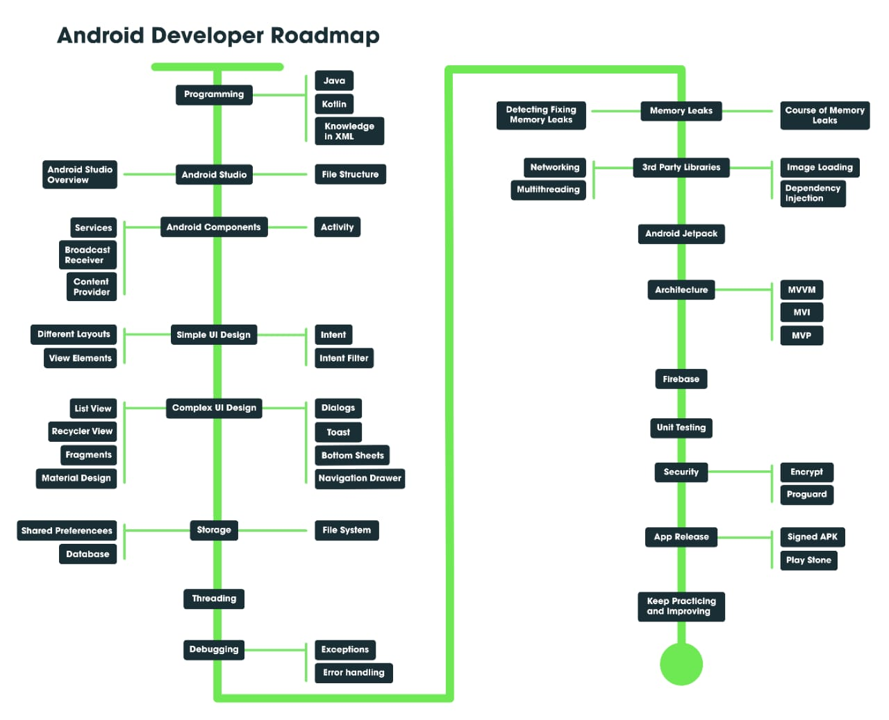

# App Dev

## A+ Session

[App T+ Session 2021](https://docs.google.com/presentation/d/1LZon85MyDT3KEUaJ8pSoS1sTzsZxjMEwNBjDqe7e5lU/edit?usp=sharing)

## Native Android

### FlowChart

### Android Studio Installation

[https://youtu.be/0zx_eFyHRU0](https://youtu.be/0zx_eFyHRU0)

### Kotlin

[Kotlin Bootcamp for Programmers | Udacity Free Courses](https://www.udacity.com/course/kotlin-bootcamp-for-programmers--ud9011)

[Google Android Developers Course](https://developer.android.com/courses)

### Java - Android Basics

[Android Basics: User Interface | Udacity](https://www.udacity.com/course/android-basics-user-interface--ud834)

[Android Basics: Multiscreen Apps | Udacity Free Courses](https://www.udacity.com/course/android-basics-multiscreen-apps--ud839)

[Android Basics: Networking | Udacity Free Courses](https://www.udacity.com/course/android-basics-networking--ud843)

#### Project Based

[THE COMPLETE ANDROID KOTLIN DEVELOPER COURSE Udemy Free Download - GetFreeCourses](https://getfreecourses.co/the-complete-android-kotlin-developer-course/)

#### YouTube References

[Reso Coder](https://www.youtube.com/c/ResoCoder/videos)

[Coding in Flow](https://www.youtube.com/c/CodinginFlow/videos)

#### Firebase

[Android Studio - Firebase Backend Tutorial Full Course](https://youtube.com/playlist?list=PLGCjwl1RrtcTXrWuRTa59RyRmQ4OedWrt)

## **Flutter**

### RoadMap

[Roadmap To Become A Flutter Developer (Resources for Beginners)](https://medium.com/flutterdevs/roadmap-to-become-a-flutter-developer-resources-for-beginners-ccb68718c84b)

[Flutter By Pawan Kumar.docx](https://drive.google.com/file/d/1pCYi8LwJCQXG_DchXyMRILYcI7mnA9Aq/view)

### Flutter configuration on Android Studio

[https://www.youtube.com/watch?v=47keBFllFvQ](https://www.youtube.com/watch?v=47keBFllFvQ)

### Basics

[Flutter Crash Course for Beginners 2020 - Build a Flutter App with Google's Flutter & Dart](https://www.youtube.com/watch?v=x0uinJvhNxI)

### Online Course

[The Complete 2021 Flutter Development Bootcamp With Dart Udemy Free Download - GetFreeCourses](https://getfreecourses.co/complete-flutter-development-bootcamp-with-dart/)

### Firebase

[FlutterFire | FlutterFire](https://firebase.flutter.dev/)

[Flutter & Firebase App Tutorial #1 - Introduction](https://www.youtube.com/watch?v=sfA3NWDBPZ4&list=PL4cUxeGkcC9j--TKIdkb3ISfRbJeJYQwC)

### Example tutorials

[https://drive.google.com/file/d/1pCYi8LwJCQXG_DchXyMRILYcI7mnA9Aq/view](https://drive.google.com/file/d/1pCYi8LwJCQXG_DchXyMRILYcI7mnA9Aq/view)

## Native iOS

### Swift

[How to learn Swift programming for free in 2020](https://www.hackingwithswift.com/articles/2/how-to-learn-swift-programming-for-free)

[Swift - Apple Developer](https://developer.apple.com/swift/)

[Swift Resources - Apple Developer](https://developer.apple.com/swift/resources/)

### Tutorials by Apple 

[Apple Developer Documentation](https://developer.apple.com/tutorials/app-dev-training)

[Apple Developer Documentation](https://developer.apple.com/tutorials/swiftui/)

### Udemy

[iOS & Swift - The Complete iOS App Development Bootcamp](https://www.udemy.com/share/101WsW/)

[SwiftUI Masterclass 2021 - iOS 14 App Development & Swift 5](https://www.udemy.com/share/102drs/)

### Youtube

[CodeWithChris](https://www.youtube.com/user/CodeWithChris)

[Lets Build That App](https://www.youtube.com/channel/UCuP2vJ6kRutQBfRmdcI92mA)

[Brian Advent](https://www.youtube.com/channel/UCysEngjfeIYapEER9K8aikw)

[Yogesh Patel](https://www.youtube.com/channel/UCvtOhkUpvgvZcFWntgW0VMw)

[YouTube Channel](https://www.youtube.com/channel/UCmJi5RdDLgzvkl3Ly0DRMlQ)

[Kilo Loco](https://www.youtube.com/channel/UCv75sKQFFIenWHrprnrR9aA)

## React Native

### Vanilla JavaScript

[JavaScript Crash Course For Beginners](https://youtu.be/hdI2bqOjy3c)

[JavaScript Higher Order Functions & Arrays](https://youtu.be/rRgD1yVwIvE)

[JavaScript OOP Crash Course (ES5 & ES6)](https://youtu.be/vDJpGenyHaA)

[Async JS Crash Course - Callbacks, Promises, Async Await](https://youtu.be/PoRJizFvM7s)

[Eloquent Js PDF](https://eloquentjavascript.net/2nd_edition/Eloquent_JavaScript_small.pdf)

Advisable to read/skim through at least the first six chapters and the 9th chapter for more detailed knowledge on JS

### React Native Docs

[React Native](https://reactnative.dev/)

### React Native Basics

[The Complete React Native + Hooks Course [2020 Edition]](https://www.udemy.com/course/the-complete-react-native-and-redux-course/)

This course requires no previous knowledge of react, but is still good for people with react knowledge

[The Ultimate React Native Course](https://codewithmosh.com/p/the-ultimate-react-native-course)

This course is for people already familiar with react

### React Native Advanced

[React Native: Advanced Concepts Tutorial](https://www.udemy.com/course/react-native-advanced/)

Uses Class based components rather than functional based components, so you might have to brush up on that

[William Candillon](https://www.youtube.com/user/wcandill)
