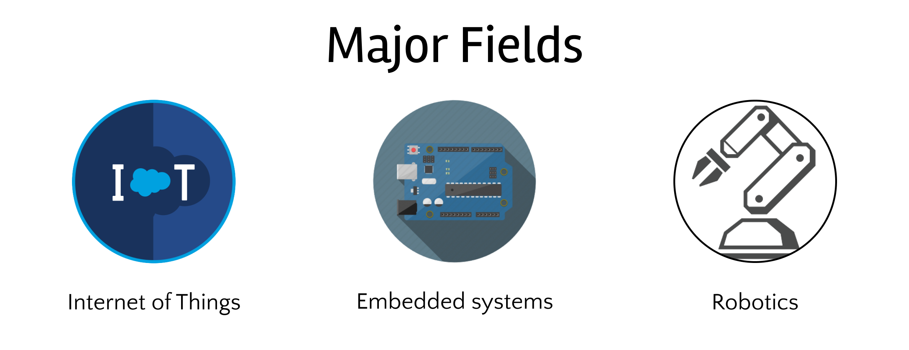

# Electronics

---

---

## Getting started with Arduino

[Arduino Step by Step: Getting Started](https://www.udemy.com/course/arduino-sbs-17gs/)

[Arduino for Dummies by John Nussey - PDF Drive](https://www.pdfdrive.com/arduino-for-dummies-e185899379.html)

[Arduino Workshop for Beginners](https://www.youtube.com/playlist?list=PLPK2l9Knytg5s2dk8V09thBmNl2g5pRSr)

[Arduino Lessons](https://www.youtube.com/playlist?list=PLGs0VKk2DiYx6CMdOQR_hmJ2NbB4mZQn-)

[New Arduino Tutorials](https://www.youtube.com/playlist?list=PLGs0VKk2DiYw-L-RibttcvK-WBZm8WLEP)

---

## Guided projects

[Arduino Projects For Dummies by Brock Craft - PDF Drive](https://www.pdfdrive.com/arduino-projects-for-dummies-e33405793.html)

[Arduino Step by Step Getting Serious](https://www.udemy.com/course/arduino-sbs-getting-serious/)

[Electronics Projects](https://www.youtube.com/playlist?list=PLAROrg3NQn7dGPxb9CFtxwbgzLNaaj1Oe)

[Electronoobs](https://www.youtube.com/channel/UCjiVhIvGmRZixSzupD0sS9Q)

---

## Getting started with Raspberry Pi

[Raspberry Pi with Linux LESSONS](https://www.youtube.com/playlist?list=PLGs0VKk2DiYypuwUUM2wxzcI9BJHK4Bfh)

[Raspberry Pi For Dummies 3rd Edition - PDF Drive](https://www.pdfdrive.com/raspberry-pi-for-dummies-3rd-edition-e89453925.html)

[Raspberry Pi® Projects For Dummies by Mike Cook - PDF Drive](https://www.pdfdrive.com/raspberry-pi-projects-for-dummies-e47672600.html)

---

## Arduino intermediate and advanced

[Using Arduino with Python LESSONS](https://www.youtube.com/playlist?list=PLGs0VKk2DiYylFUUMMv9WiL3x3tpscDUQ)

[9 Axis Inertial Measurement Units With Arduino Tutorial](https://www.youtube.com/playlist?list=PLGs0VKk2DiYwEo-k0mjIkWXlkrJWAU4L9)

[DroneBot Workshop](https://www.youtube.com/channel/UCzml9bXoEM0itbcE96CB03w)

---

## Raising the bar with electronics

[Learning Artificial Intelligence on the Jetson Nano](https://www.youtube.com/playlist?list=PLGs0VKk2DiYxP-ElZ7-QXIERFFPkOuP4_)

[Andreas Spiess](https://www.youtube.com/c/AndreasSpiess/playlists)
