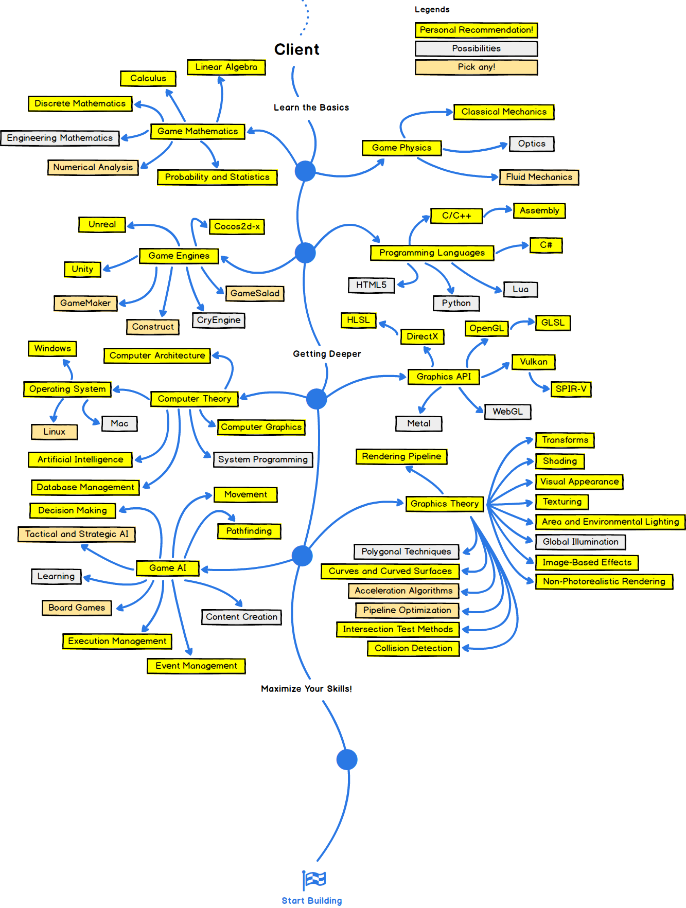

# Game Development

# **Unity**

Make a developer account on Unity's official website using your VIT Email-ID and get access to Unity certified courses.

### Installation

[How To Install Unity Game Engine (Getting Started)](https://www.youtube.com/watch?v=KMuMhA6Lk0I)

### Basics

[LEARN UNITY - The Most BASIC TUTORIAL I'll Ever Make](https://www.youtube.com/watch?v=pwZpJzpE2lQ&t=7s)

[Learn C# BASICS in 10 MINUTES!](https://www.youtube.com/watch?v=IFayQioG71A)

[Learn C# Scripting for Unity in 15 Minutes (2020)](https://www.youtube.com/watch?v=9tMvzrqBUP8)

### Courses

Courses are good but try to learn through documentation and then implement stuff.

[THE ULTIMATE GUIDE TO GAME DEVELOPMENT WITH UNITY 2019 Udemy Free Download - GetFreeCourses](https://getfreecourses.co/the-ultimate-guide-to-game-development-with-unity/)

[Complete C# Unity Developer 3D: Learn To Code Making Games Udemy Free Download - GetFreeCourses](https://getfreecourses.co/1-complete-c-unity-developer-3d-learn-to-code-making-games/)

### Guided Projects

Follow the tutorials, code along and try to make something new with your newly gained knowledge. Project based learning is the most efficient form of learning.

[ENDLESS RUNNER TUTORIAL SERIES](https://youtube.com/playlist?list=PLBIb_auVtBwBkYGKni2wKHGVFP5b4pVwj)

[Unity FPS Survival Game Tutorial - First Person Shooter Game Dev](https://www.youtube.com/watch?v=Sqb-Ue7wpsI)

[Create Among Us in Unity](https://youtube.com/playlist?list=PLWeGoBm1YHVgCFibptBSJZM68sjwtAe8g)

### Game Design

Speed level game design videos for motivation :)

[Speed Level Design in Unity 2020.1](https://www.youtube.com/watch?v=DXh7yeCFD5Y)

[[UNITY] SGD: Winter forest in mountains | Speed Level Design](https://www.youtube.com/watch?v=v0nIHvM3JS4)

# **Unreal Engine 4**

Unreal Engine 4 (UE4) is one of the most advanced game engines out there going head to head with Unity all the time. You want better graphics? Use UE4. Simple as that.

### Installation

The best way to install UE4 is to simply follow the documentation on their site. It guarantees 100% success every single time, plus there is a link to a very vibrant community and forum that will help you overcome issues, if any.

[Installing Unreal Engine](https://docs.unrealengine.com/en-US/Basics/InstallingUnrealEngine/index.html)

[Forum](https://forums.unrealengine.com/)

[UE4 AnswerHub - UE4 AnswerHub](https://answers.unrealengine.com/index.html)

### Basics

There are two ways you can go about learning UE4.

1. Learning game development using Blueprints: Blueprints is a very popular feature in Unreal Engine and it enables creation of games using simple blocks and flowcharts. Almost all the functionalities of UE4 can be accomplished using blueprints and considering the level where it is right now, it is one of the easiest and most powerful ways to make games. It is nearly equivalent to scripting in C++.

    [Unreal Engine Blueprint Developer Tutorial: Learn Visual Scripting](https://www.udemy.com/course/unrealblueprint/)

2. Learning game development using C++ C++ is one of the most powerful languages out there and one of the most popular for game development. Scripting in C++ allows you to have a certain level of control over your game that blueprints simply cannot offer.

    [Unreal Engine 4 Course (Create Multiplayer Games with C++)](https://www.udemy.com/course/unrealcourse/)

I'd recommend everyone to explore the resources provided by the creators, the [GameDev.tv](http://gamedev.tv) Team. They have a discord channel with an amazing community of people ready to help you.

### Getting off the ground with UE4

Some awesome channels to get up and running with UE4

[Matthew Palaje](https://www.youtube.com/c/MatthewPalaje/featured)

[Reuben Ward](https://www.youtube.com/c/ReubenWardTutorials/videos)

[Mathew Wadstein](https://www.youtube.com/channel/UCOVfF7PfLbRdVEm0hONTrNQ)

[Alen Loeb](https://www.youtube.com/channel/UCN0ltBbl0xwZeYg6hNlXrvA)

[Dean Ashford](https://www.youtube.com/channel/UCAaWnOJ4iFSQluBVNS2d-Ew)

[Dev Enabled](https://www.youtube.com/channel/UCL1jcpKRApOp_CkW9LkFRKA)

### Guided projects

Best way to put what you've learnt into practice? Get your hands dirty.

[Unreal Engine 4: Make a Multiplayer First Person Shooter!](https://www.udemy.com/course/create-a-multiplayer-fps-in-unreal-engine-4/)

[Unreal Engine 4 - Multiplayer Team Based FPS In Blueprints](https://www.udemy.com/course/unreal-engine-4-multiplayer-team-based-fps-in-blueprints/)

[Unreal Engine 4: How to Develop & Use Your First Two Games](https://www.udemy.com/course/unreale4/)

[Unreal Engine C++ The Ultimate Game Developer Course](https://www.udemy.com/course/unreal-engine-the-ultimate-game-developer-course/)

### Gods of Game Dev

Go through these playlists to learn anything about game development. Look up these videos if you want to add a particular functionality or component to your game.

[Brackeys YT Channel](https://www.youtube.com/user/Brackeys)

[Jason Weilman YT Channel](https://www.youtube.com/channel/UCX_b3NNQN5bzExm-22-NVVg)

[Dani YT Channel](https://www.youtube.com/channel/UCIabPXjvT5BVTxRDPCBBOOQ)
