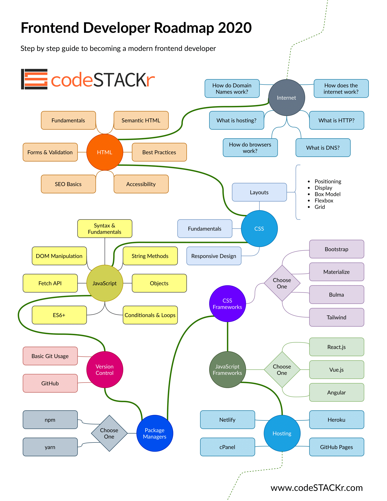

# Web Development

## Visual Studio Code - Installation and Basics

[Visual Studio Code Tutorial for Beginners - Introduction](https://youtu.be/VqCgcpAypFQ)

## Git Basics

[Learn Git in 30 Minutes](https://youtu.be/N_bMCff8q6A)

## Road Map

# Advance roadmaps

[Developer Roadmaps](https://roadmap.sh/)

## HTML and CSS Basics

[HTML & CSS Crash Course Tutorial](https://youtube.com/playlist?list=PL4cUxeGkcC9ivBf_eKCPIAYXWzLlPAm6G)

## Advanced CSS

[Advanced CSS and Sass: Flexbox, Grid, Animations and More](https://www.udemy.com/share/101Wkw/)

# Full stack

[The Complete Web Developer in 2021: Zero to Mastery](https://www.udemy.com/course/the-complete-web-developer-zero-to-mastery/)

# Flask

[Learning Flask](https://www.youtube.com/playlist?list=PLF2JzgCW6-YY_TZCmBrbOpgx5pSNBD0_L)

# Nodejs

[The Complete Node.js Developer Course (3rd Edition)](https://www.udemy.com/course/the-complete-nodejs-developer-course-2/)

# React

[Complete React Developer in 2021 (w/ Redux, Hooks, GraphQL)](https://www.udemy.com/course/complete-react-developer-zero-to-mastery/)

[Modern React with Redux Training Course](https://www.udemy.com/course/react-redux/)

# Django

[Django documentation | Django documentation | Django](https://docs.djangoproject.com/en/3.1/)

[Python Django Dev To Deployment](https://www.udemy.com/course/python-django-dev-to-deployment/)

[https://www.youtube.com/watch?v=qgGIqRFvFFk&list=PL6gx4Cwl9DGBlmzzFcLgDhKTTfNLfX1IK](https://www.youtube.com/watch?v=qgGIqRFvFFk&list=PL6gx4Cwl9DGBlmzzFcLgDhKTTfNLfX1IK)

# W+ Techloop

- Frontend
- Internet and Backend

[https://www.notion.so/Web-Dev-601bec0b261a4458b68812d03736ae07#5c6333fc8685410cb06296e122cb3b0d](https://www.notion.so/Web-Dev-601bec0b261a4458b68812d03736ae07#5c6333fc8685410cb06296e122cb3b0d)
