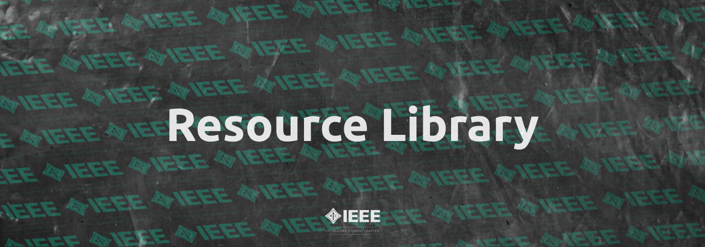

# Resource Library

## About

This is a resource library to get you started in the following domains, curated specially by IEEE-VIT.

You can find a pretty rendered version of the same on [Notion](https://www.notion.so/Resources-107a73c9ca4842c1876c0b2e996f09c9).

## Table of contents

- [App Development](https://github.com/IEEE-VIT/resources/tree/master/App%20Development)
- [Augmented Reality](https://github.com/IEEE-VIT/resources/tree/master/Augmented%20Reality)
- [Cybersecurity](https://github.com/IEEE-VIT/resources/tree/master/Cybersecurity)
- [Electronics](https://github.com/IEEE-VIT/resources/tree/master/Electronics)
- [Game Development](https://github.com/IEEE-VIT/resources/tree/master/Game%20Development)
- [Machine Learning](https://github.com/IEEE-VIT/resources/tree/master/Machine%20Learning)
- [Web Development](https://github.com/IEEE-VIT/resources/tree/master/Web%20Development)

## Contribution Guidelines

If you'd like to recommend or update any resource, feel free to send a pull request, please keep in mind:

- Resource content should be a permalink and should not expire
- If attaching any media asset, should not exceed 2.5 MB, this ensures better readability for the user
- Make sure to adhere to [Markdown Guidelines](https://google.github.io/styleguide/docguide/style.html)

Made with ❤ by IEEE-VIT

